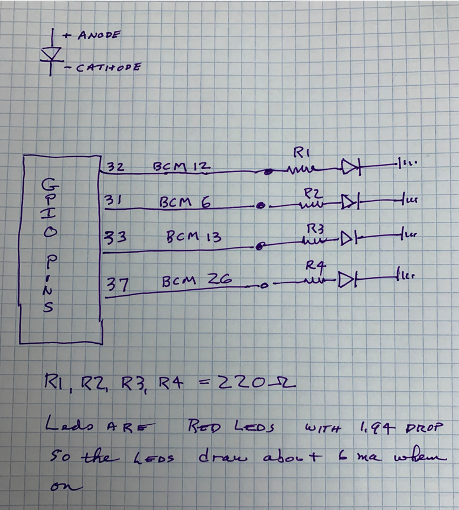

# Spring Boot 3.0.0 Demo for PI4J

I like to keep up with the latest version of Spring Boot. I therefore decided to create a new project for demoing the
use of the Raspberry PI GPIO pins.
I had created a project a year or so ago to work with the GPIO but believed I only used the GPIO as input.
I now have a project that needs to use GPIO for both input and output.

I went to PI4J.com to get the latest information and build of the pi4j files available. I saw the version 2.2.1 was
available so decided to use that.
To my surprise the code does not seem to work. I feel I am doing something wrong so have created this project to present
to the community to see if any one out there can tell me what is wrong.

My first clue is that in all the examples I've seen the pigpio-output-provider is chosen as the provider when setting up
the output. However, when I use that choice I get an error that says there is no such provider. The list of providers
only returns the raspberrypi-output-provider. How do I make that available?

## Project Code Description

This project sets up 4 of the GPIO pins as outputs. I created a Spring Component class that acts as a service that
handles all GPIO.

When the class is initialized I have the constructor create the pi4j context and have the constructor initialize the
pins I will be using. The input and output pins that I will be using in my real project are included in this
initialization.

The class also has a method annotated with @Destroy which causes the pi4j context to be shutdown when the application
shuts down. This works really nice.

I use the PrintInfo class that I found somewhere on the pi4j.com website to print out the platforms, providers and
registry after the initialzation is done.

I also created a rest controller with endpoint named /blinkLeds/{loopcount} where you can browse to a web page and log
in as user named demo and password named testpi4j. Once logged in the endpoint will ask the service to turn all 4
outputs on, then off and pause one second between each change.

To test the blinkLeds endpoint first connect your raspberrypi to the internet. Find your pi's IP address then type the following into a browser:

https://192.168.1.8:9443/blinkLeds/10

(my pi's IP address is 192.168.1.8) and note that the port I use is 9443. That can be changed in the program if you need to. It
is in the application.yml - as is the user name and password.

You will be asked to login. The user is demo and the password is testpi4j


When watching the log, it can be seen that all outputs "appear" to be doing as commanded, yet when looking at the led's
nothing is happening.

I wrote a small python program to do the same thing and it works fine; the leds all respond as commanded.

## To Build the application
I used IntelliJ to load the project and build it. I am using Maven 3.8.4 and Java 17. Once the project is built I copy
it do my Raspberry PI.

## Running the application

To run this you will need Java 17 installed.
I copied the jar file to a directory on the raspberry pi. I use the IntelliJ IDE so I can also remotely debug the application.
I use the following command to debug remotely. This command starts up the application and will place the logging in a file named demoOutput.

```
cd /home/pi
sudo -jar -agentlib:jdwp=transport=dt_socket,server=y,suspend=n,address=*:5005 DemoForPI4J-0.0.1-SNAPSHOT.jar > demoOutput.log &
```
To start it up without the debugger (probably the normal method)
```
sudo java -jar DemoForPI4J-0.0.1-SNAPSHOT.jar &
```

## the circuit

I wired up the test circuit to a breadboard as shown below.



## PrintInfo information

A sample of the output from when this project starts up can be found [here](src/documentation/demoOutput)

## default platform

PLATFORM: "RaspberryPi Platform" {raspberrypi}
<com.pi4j.plugin.raspberrypi.platform.RaspberryPiPlatform>
{Pi4J Platform for the RaspberryPi series of products.}

## default Output Provider

I see the default provider for Digital Outputs is raspberrypi-digital-output
├─DIGITAL_OUTPUT: [1] <com.pi4j.io.gpio.digital.DigitalOutputProvider>
│ └─PROVIDER: "RaspberryPi Digital Output (GPIO) Provider" {raspberrypi-digital-output}
<com.pi4j.plugin.raspberrypi.provider.gpio.digital.RpiDigitalOutputProviderImpl>
{com.pi4j.plugin.raspberrypi.provider.gpio.digital.RpiDigitalOutputProviderImpl}

## Registry

REGISTRY: [6] "I/O Registered Instances" <com.pi4j.registry.impl.DefaultRegistry>
├─IO: "ChannelBit2" {PIN_OUT_CHANNEL2} <com.pi4j.plugin.raspberrypi.provider.gpio.digital.RpiDigitalOutput> {DOUT-6}
├─IO: "SignalLock" {PIN_OUT_SIGNAL_LOCK} <com.pi4j.plugin.raspberrypi.provider.gpio.digital.RpiDigitalOutput> {DOUT-13}
├─IO: "ChannelBit1" {PIN_OUT_CHANNEL1} <com.pi4j.plugin.raspberrypi.provider.gpio.digital.RpiDigitalOutput> {DOUT-26}
├─IO: "ChannelBit4" {PIN_OUT_CHANNEL4} <com.pi4j.plugin.raspberrypi.provider.gpio.digital.RpiDigitalOutput> {DOUT-12}
├─IO: "freeze input" {freeze} <com.pi4j.plugin.raspberrypi.provider.gpio.digital.RpiDigitalInput> {DIN-19}
└─IO: "ShutDown Signal" {shutdown} <com.pi4j.plugin.raspberrypi.provider.gpio.digital.RpiDigitalInput> {DIN-14}

## Summary

All of this looks good. The only problem is that in other examples shown, the default provider is always shown to be
pigpio-output-provider and those are shown to work by the example, but when using the raspberrypi-output-provider the
code does not seem to work.
